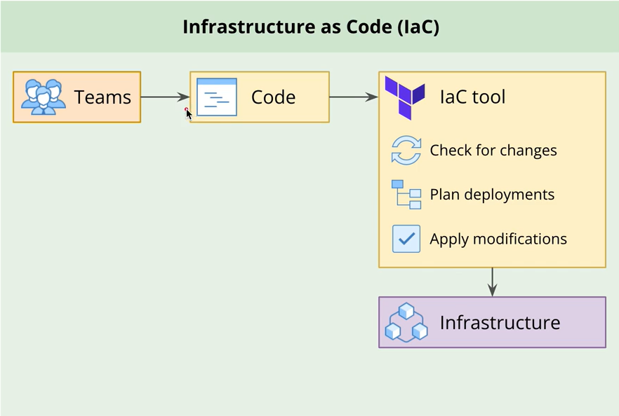
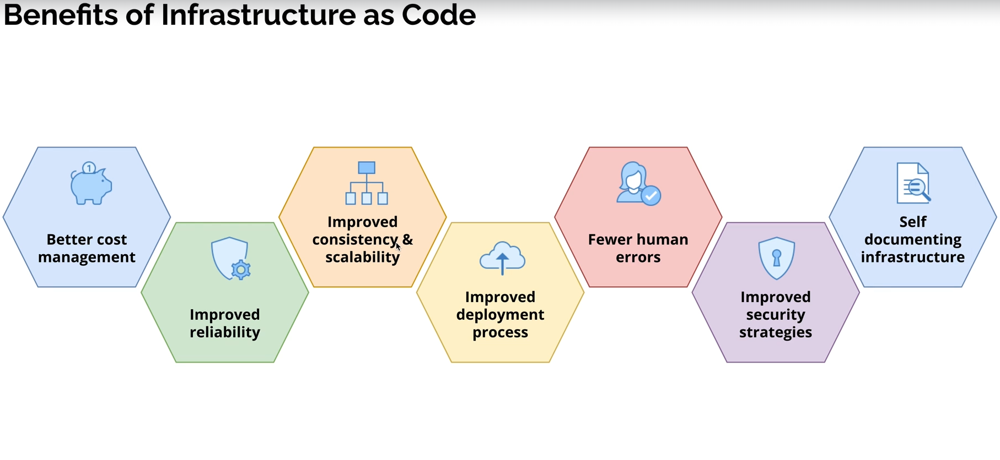

# Terraform Learning Repository

Welcome to my Terraform Learning Repository! 🎉 This space showcases all the exercises and projects I've completed on my journey to mastering Terraform.

## IaC Diagram

## Benefits of IaC

## Contents

- **Exercises**: Hands-on practice to grasp Terraform basics.
- **Projects**: Real-world scenarios to solidify and apply Terraform skills.

## Course Reference

This repository is built upon the knowledge gained from the **Udemy course - [Mastering Terraform from Beginner to Expert](https://www.udemy.com/course/mastering-terraform-beginner-to-expert/)**. The course guided me from the fundamentals to advanced techniques, helping me build the skills showcased here.
